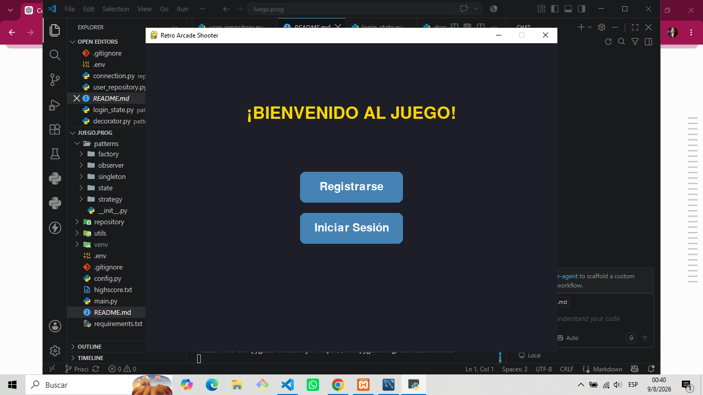
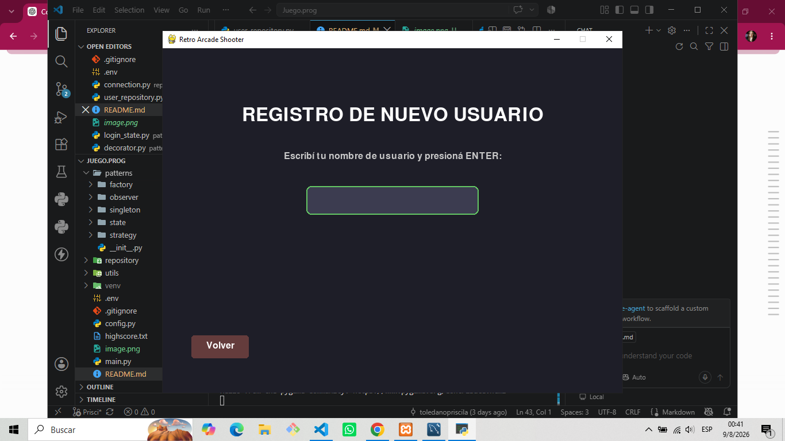
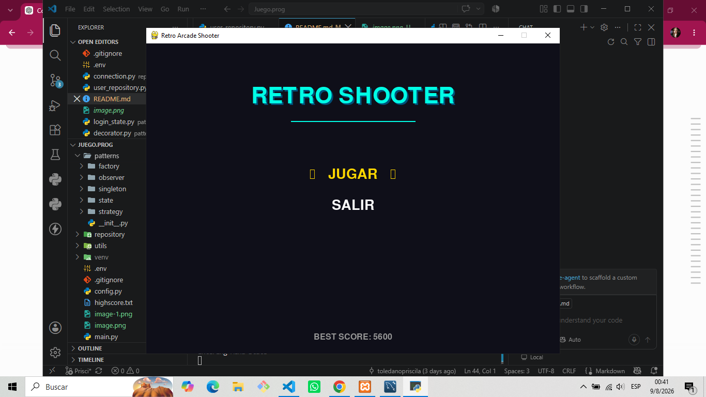
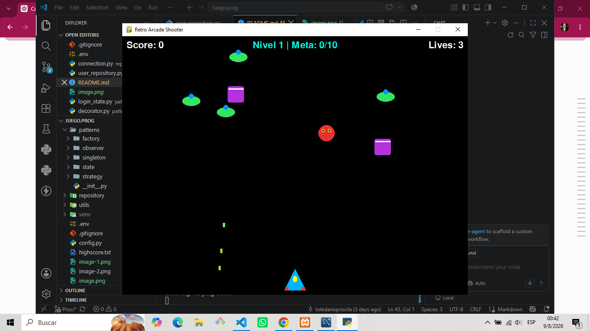
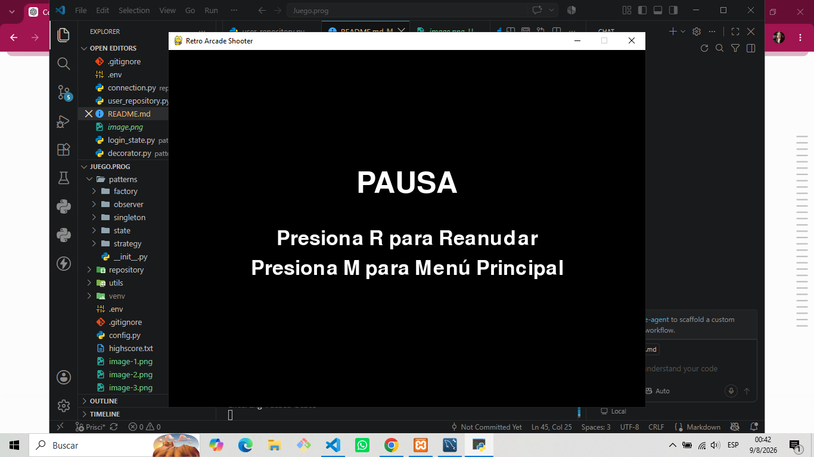

# Retro Arcade Shooter - TP Programación II

## Integrantes
Priscila Toledano
Tomas Naveda
Claudio Perez
Selene Quintero

## Descripción del juego 
Retro Arcade Shooter es un videojuego de disparos en 2D desarrollado en Python utilizando la librería Pygame. El objetivo del juego es sobrevivir a oleadas infinitas de enemigos destructivos, superando niveles de dificultad progresiva, acumulando puntos y evitando perder las tres vidas disponibles.

## Historia
En un futuro lejano, la galaxia ha sido invadida por flotas alienígenas hostiles (Abejitas, Platillos y Tanques mecánicos). A bordo de nuestra nave estelar de última generación, la misión es pilotar a través del espacio profundo, repeler el ataque enemigo y restaurar la paz estelar nivel tras nivel.

## Tecnologías usadas
* **Lenguaje:** Python 3.10+
* **Librería Gráfica y de Audio:** Pygame
* **Base de Datos:** MySQL (MySQL Workbench)
* **Control de Versiones:** Git y GitHub

## Instalación
Para instalar el proyecto en tu computadora, hay que hacer estos pasos desde la terminal:
1. Clonar el repositorio: 
2. Crear y activar un entorno virtual: 
   `python -m venv env`
   `env\Scripts\activate`
3. Instalar las dependencias necesarias ejecutando: `pip install pygame mysql-connector-python`

## Ejecución
Asegurate de tener tu servidor de base de datos encendido (XAMPP / MySQL) y ejecutá el archivo principal con el siguiente comando en la terminal:
`python main.py`

## Controles
* **Movimiento Izquierda:** Flecha Izquierda o tecla A
* **Movimiento Derecha:** Flecha Derecha o tecla D
* **Disparar:** Tecla ESPACIO (Space)
* **Pausar el juego:** Tecla ESC
* **Navegar en menús:** Flechas arriba/abajo o teclas W / S y ENTER para seleccionar
* **Reiniciar Nivel / Ir al Menú (en Pantalla de Game Over):** Teclas R o M

## Capturas

## Explicación de Patrones de Diseño
El proyecto aplica estrictamente los 7 patrones de diseño solicitados en la arquitectura:
1. **Singleton:** Utilizado en `DatabaseConnection` y `SoundManager` para garantizar una única instancia global de conexión a la base de datos y de gestión de audio, evitando recursos duplicados.
2. **Factory Method:** Implementado mediante `EnemyFactory` y `BulletFactory` para la creación desacoplada de enemigos aleatorios (Abejitas, Platillos, Tanques) y proyectiles.
3. **Observer:** Estructurado en `GameStats` para notificar automáticamente los cambios de puntaje, vidas y niveles hacia la interfaz de usuario (HUD) sin acoplamiento rígido.
4. **State:** Columna vertebral del flujo de pantallas (`LoginState`, `MenuState`, `PlayingState`, `PausedState`, `GameOverState`) administradas limpiamente por el `StateManager`.
5. **Strategy:** Empleado en las clases de movimiento (`SimpleMovement` y `ZigzagMovement`) para modularizar las distintas estrategias de desplazamiento de los enemigos.
6. **Command:** Modelado en las clases de acciones (`MoveLeftCommand`, `MoveRightCommand`, `ShootCommand`) para encapsular las solicitudes de control del jugador.
7. **Decorator:** Estructurado con `PlayerDecorator` y `DoubleShotDecorator` para permitir la extensión dinámica de funcionalidades sobre la nave (como el disparo múltiple) sin alterar su clase base.

## Explicación de Base de Datos (MySQL)
El sistema se conecta a una base de datos relacional en MySQL llamada `juego_programacion2` que gestiona dos tablas principales:
* **`usuarios`:** Almacena de forma única el `username` de cada jugador junto con su nivel actual (`current_level`) y su puntaje máximo (`max_score`). Permite que el sistema busque al usuario al iniciar sesión y recupere automáticamente su progreso guardado.
* **`historial_partidas`:** Registra un historial detallado de cada partida jugada, guardando el nombre del usuario, el puntaje obtenido, el nivel alcanzado y la fecha exacta del evento vinculado mediante una llave foránea.